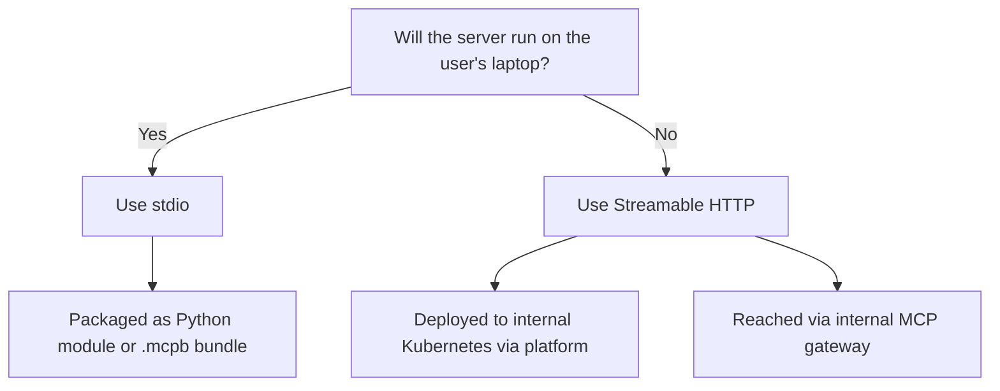
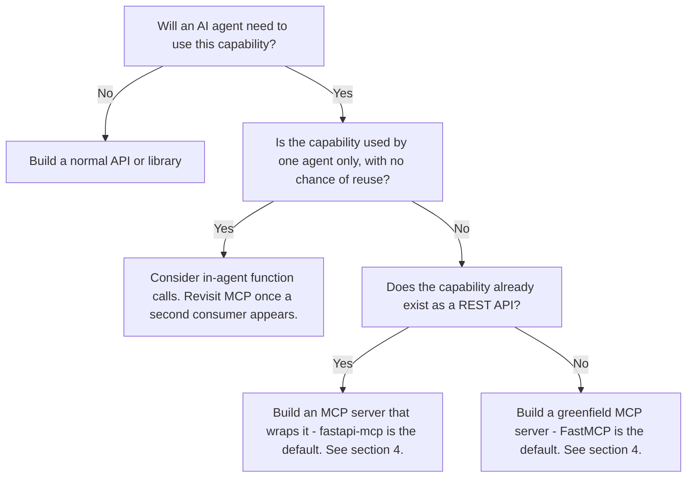
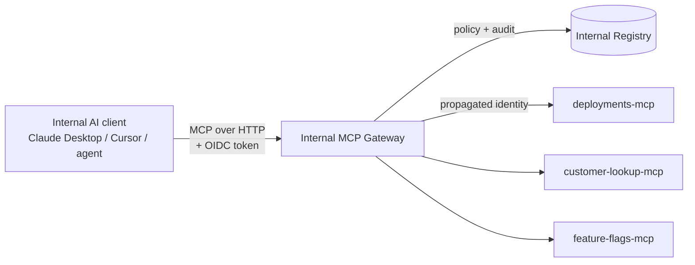

# MCP Server Design & Implementation Playbook

**A canonical engineering reference for designing, building, reviewing, and operating internal Model Context Protocol servers.**

> **Status:** Authoritative. This document governs the design and implementation of all internal MCP servers.
> **Scope:** MCP servers built and operated for **internal use only** — consumed by employees, internal AI assistants, and internal automation. **Out of scope:** publicly distributed MCP servers.
> **Primary stack:** Python 3.11+, FastAPI, `fastapi-mcp` (default), Pydantic v2, Docker, Kubernetes.

---

## Conventions used in this document

Normative requirements use [RFC 2119](https://www.rfc-editor.org/rfc/rfc2119) keywords:

- **MUST / MUST NOT** — non-negotiable. Violations block launch.
- **SHOULD / SHOULD NOT** — strong default. Deviation requires a documented justification approved by an architecture reviewer.
- **MAY** — optional. Choose based on context.

Code examples are written for `fastapi-mcp` unless explicitly stated otherwise. Replace placeholder values (URLs, names, tokens) with environment-appropriate values.

---

# Table of Contents

1. [Executive Summary](#1-executive-summary)
2. [MCP Fundamentals](#2-mcp-fundamentals)
3. [When to Build an MCP Server](#3-when-to-build-an-mcp-server)
4. [Choosing a Library: fastapi-mcp vs FastMCP vs Official SDK](#4-choosing-a-library)
5. [Architecture & Project Structure](#5-architecture--project-structure)
6. [Tool Design Principles](#6-tool-design-principles)
7. [Naming Conventions & Metadata Standards](#7-naming-conventions--metadata-standards)
8. [Schema & Type Design](#8-schema--type-design)
9. [Authentication & Authorization](#9-authentication--authorization)
10. [Security Requirements](#10-security-requirements)
11. [Error Handling](#11-error-handling)
12. [Logging, Observability & Telemetry](#12-logging-observability--telemetry)
13. [Versioning & Change Management](#13-versioning--change-management)
14. [Testing Strategy](#14-testing-strategy)
15. [Documentation Standards](#15-documentation-standards)
16. [Deployment Patterns](#16-deployment-patterns)
17. [Internal MCP Registry & Gateway](#17-internal-mcp-registry--gateway)
18. [Governance & Review Process](#18-governance--review-process)
19. [Anti-Patterns Gallery](#19-anti-patterns-gallery)
20. [Reference Implementations & Templates](#20-reference-implementations--templates)
21. [Appendices](#21-appendices)

---

# 1. Executive Summary

The Model Context Protocol (MCP) is an open, JSON-RPC 2.0-based protocol that standardizes how AI applications (hosts) connect to tools, data, and services. It is the "USB-C of AI integrations": one well-built MCP server can be consumed by Claude Desktop, Cursor, VS Code, internal agents, and any other compliant host without bespoke wiring.

We are standardizing on MCP for internal AI tool integration because:

1. **Single integration model.** Today we have ad-hoc REST clients, custom function-calling glue, and one-off scripts wired into each agent. MCP collapses these into one contract.
2. **Reusability.** A team that builds an MCP server for, say, deployment status, can have it instantly used by every internal AI client without code changes on the client side.
3. **Security boundary.** MCP gives us a natural place to enforce authentication, authorization, audit logging, and policy — instead of scattering those across every agent.
4. **Spec stability.** The protocol is maintained by an open working group with multiple major contributors; it is now a de facto industry standard.

**What this playbook mandates.** Every internal MCP server **MUST**:

- Be built in Python using one of the libraries approved in §4.
- Pass the security, naming, schema, and documentation requirements in §6–§10.
- Be deployed through the internal platform (§16) and registered in the internal MCP registry (§17).
- Pass the design review checklist (§18) before launch.

**What this playbook recommends.** Beyond the mandates, this document encodes defaults — chosen so that 80% of MCP servers can be built without revisiting these decisions. Section 4 picks libraries; §5 picks project layout; §16 picks deployment shape. Deviate only when you have a reason that survives a design review.

**Who this is for.** Backend engineers (primary builders), tech leads (reviewers), the platform and security teams (gatekeepers), and product managers (scoping new MCP servers).

---

# 2. MCP Fundamentals

## 2.1 The protocol in one paragraph

MCP is a JSON-RPC 2.0 protocol spoken between an **MCP host** (the AI application — Claude Desktop, Cursor, an internal agent), an **MCP client** (one per connected server, instantiated by the host), and an **MCP server** (the thing you're building — exposes capabilities). The transport underneath JSON-RPC can be **stdio** (the server is a subprocess of the host) or **Streamable HTTP** (the server runs over the network; SSE is supported as a legacy variant). Capabilities are discovered at connect time; the host can then invoke them on the user's behalf.

## 2.2 Server primitives

A server exposes any combination of the following:

| Primitive | What it is | When to use |
|-----------|------------|-------------|
| **Tools** | Model-invocable functions with typed input/output schemas | The default and most common primitive. Anything the agent should "do". |
| **Resources** | Read-only data sources addressable by URI | Files, records, snapshots the model should "read" |
| **Prompts** | Parameterized prompt templates the host can offer | Reusable workflow starters; rarely needed for internal servers |
| **Sampling** | Server asks the host to run an LLM completion | Advanced; agentic servers that need an LLM internally |
| **Elicitation** | Server asks the client to ask the user for input | When the server needs a missing parameter mid-call |
| **Roots** | Filesystem boundaries the host advertises | Local servers that need to know "where am I allowed to look" |

For internal use, **tools are the workhorse**. Resources come second. The rest are rare and **SHOULD NOT** be used without an architecture review.

## 2.3 Transports — when to use which



- **stdio** — server runs as a subprocess launched by the host. No network. Auth = inheriting the user's machine identity. Use for: developer tools that touch the local filesystem, low-risk personal productivity tools.
- **Streamable HTTP** — server runs as a normal web service. Use for: anything that touches shared backends, anything that needs centralized auth/audit, anything with non-trivial dependencies. **This is the default for internal MCP servers.**
- **SSE** — legacy transport, still in the spec. **MUST NOT** be used for new servers; use Streamable HTTP.

## 2.4 How MCP differs from a plain REST API

A REST API is designed for a developer reading docs. An MCP server is designed for a language model reading tool descriptions at runtime. The practical implications:

- **Descriptions matter more than method signatures.** A model picks tools by reading prose.
- **Schemas must be strict.** The model will pass through whatever the schema permits; loose schemas yield bad calls.
- **Fewer, sharper tools beats more, finer-grained tools.** Models get confused by 200-tool catalogs.
- **Errors are read by a model**, not displayed in a Swagger pane. They must be machine-actionable.

## 2.5 How MCP differs from OpenAI-style function calling

Function calling is a feature of a single LLM provider. MCP is a transport-level standard that any host can speak. Building MCP means your tools work with any compliant client; building OpenAI-only function specs means rebuilding for every new model.

---

# 3. When to Build an MCP Server

## 3.1 Decision framework



## 3.2 When NOT to build an MCP server

**MUST NOT** build an MCP server when:

- The capability is internal to a single agent and unlikely to be reused. Use in-agent function calls.
- The capability is high-frequency, low-latency machine-to-machine communication (e.g., a service mesh). Use gRPC or a normal REST API.
- The capability is a UI. MCP is not a UI framework.
- The capability requires real-time bi-directional streaming beyond what Streamable HTTP supports. Use WebSockets.

## 3.3 Reuse signal

A capability is a strong MCP candidate when **two or more** of the following are true:

- Multiple agents will use it.
- Multiple humans will invoke it through different AI clients.
- It encapsulates institutional knowledge (how to deploy, how to query the warehouse, how to look up customer X).
- It would otherwise be re-implemented as a "tool" in every agent that needs it.

---

# 4. Choosing a Library

Three Python libraries are approved for internal use. **MUST** pick one and document the choice in the design doc.

## 4.1 The three approved libraries

### `fastapi-mcp` (Tadata)

- **What it is.** An extension that turns an existing FastAPI app into an MCP server by auto-mapping FastAPI routes to MCP tools. Uses FastAPI's `operation_id` as the tool name and reuses the route's Pydantic schemas and `Depends()` for auth.
- **Install.** `pip install fastapi-mcp`
- **Best for.** Teams that **already have a FastAPI service** and want to expose a subset of its endpoints as MCP tools without building a second service.
- **Trade-offs.** Tightly couples the MCP surface to your HTTP surface — every route is a tool candidate, so you must be deliberate about what you expose. Less control over MCP-specific concerns (prompt design, sampling, elicitation) since the abstraction is route-centric.

### `FastMCP` (Prefect-maintained, originally by Jeremiah Lowin)

- **What it is.** A purpose-built Python framework for MCP. Decorator-driven (`@mcp.tool`, `@mcp.resource`, `@mcp.prompt`). FastMCP 1.0 was upstreamed into the official Python SDK; FastMCP 2.x/3.x is a feature-superset continuation maintained by Prefect with OAuth, OpenTelemetry, server composition, and other production features.
- **Install.** `pip install fastmcp`
- **Best for.** **Greenfield MCP servers** with no pre-existing FastAPI surface. Also when you need MCP primitives beyond tools (resources, prompts, sampling, elicitation).
- **Trade-offs.** Two MCP-adjacent code paths in our codebase (Prefect's FastMCP and the SDK's bundled FastMCP 1.0) can be confusing. Pin versions; document which you're on.

### Official MCP Python SDK (`mcp` package)

- **What it is.** The reference SDK published by the MCP working group. Includes a bundled high-level API (the upstreamed FastMCP 1.0) as well as low-level primitives.
- **Install.** `pip install mcp`
- **Best for.** **Maximum control**: custom transports, non-standard server behavior, protocol-level instrumentation, contributing back to the spec.
- **Trade-offs.** More boilerplate. Slower iteration than FastMCP. Most teams will not need this.

## 4.2 Decision matrix

| Situation | Library | Why |
|-----------|---------|-----|
| Existing FastAPI service; want to expose endpoints as tools | **`fastapi-mcp`** | Zero duplication; reuse routes, schemas, auth. |
| New MCP server, no existing API | **FastMCP** | Purpose-built; least boilerplate; decorator-driven. |
| Need resources, prompts, sampling, elicitation | **FastMCP** | First-class support for all primitives. |
| Need custom transports or protocol-level work | **Official SDK** | Direct access to the lowest level. |
| Quick internal experiment / spike | **FastMCP** | Fastest time-to-first-tool. |
| Production server with strict observability needs | **FastMCP** (3.x) or **`fastapi-mcp`** + custom middleware | Both viable; FastMCP has built-in OTel. |

## 4.3 Mandates

- **MUST** use one of the three libraries above. Other libraries (Speakeasy-generated servers, third-party converters, etc.) **MUST NOT** be used without architecture review.
- **MUST** pin the library version in `pyproject.toml` / `requirements.txt` using `~=` (compatible release) and update via PR.
- **SHOULD** default to `fastapi-mcp` if a FastAPI app already exists, FastMCP otherwise.

## 4.4 Minimal example for each library

### `fastapi-mcp`

```python
from fastapi import FastAPI
from fastapi_mcp import FastApiMCP
from pydantic import BaseModel, Field

app = FastAPI(title="Deployments API")


class DeploymentStatus(BaseModel):
    service: str
    environment: str
    revision: str
    healthy: bool


@app.get(
    "/deployments/{service}",
    operation_id="get_deployment_status",  # MUST be explicit; becomes the MCP tool name
    summary="Get the current deployment status for a service in an environment.",
    response_model=DeploymentStatus,
)
def get_deployment_status(
    service: str,
    environment: str = "production",
) -> DeploymentStatus:
    """Return the current revision and health for a service in a given environment."""
    ...


mcp = FastApiMCP(
    app,
    name="deployments-mcp",
    description="Internal deployment status and rollout tools.",
    base_url="http://deployments.internal.svc.cluster.local",  # MUST set explicitly in production
)
mcp.mount()
```

### FastMCP

```python
from fastmcp import FastMCP
from pydantic import BaseModel, Field

mcp = FastMCP("deployments-mcp")


class DeploymentStatus(BaseModel):
    service: str
    environment: str
    revision: str
    healthy: bool


@mcp.tool()
def get_deployment_status(
    service: str = Field(..., description="The service name, e.g. 'checkout-api'."),
    environment: str = Field("production", description="One of: production, staging, dev."),
) -> DeploymentStatus:
    """Return the current revision and health for a service in a given environment."""
    ...


if __name__ == "__main__":
    mcp.run(transport="streamable-http", host="0.0.0.0", port=8000)
```

### Official SDK (low level)

```python
from mcp.server import Server
from mcp.server.stdio import stdio_server
from mcp.types import Tool, TextContent

server = Server("deployments-mcp")


@server.list_tools()
async def list_tools() -> list[Tool]:
    return [
        Tool(
            name="get_deployment_status",
            description="Return the current revision and health for a service.",
            inputSchema={
                "type": "object",
                "properties": {
                    "service": {"type": "string"},
                    "environment": {"type": "string", "default": "production"},
                },
                "required": ["service"],
                "additionalProperties": False,
            },
        )
    ]


@server.call_tool()
async def call_tool(name: str, arguments: dict) -> list[TextContent]:
    if name == "get_deployment_status":
        ...
    raise ValueError(f"Unknown tool: {name}")
```

Note the boilerplate difference. The official SDK requires you to define schemas and tool listings by hand. FastMCP and `fastapi-mcp` derive them from your Python types.

---

# 5. Architecture & Project Structure

## 5.1 Standard repo layout

Every MCP server repo **MUST** follow this structure (substitute `<server_name>` with the actual server name, e.g. `deployments_mcp`):

```
<server_name>/
├── README.md
├── pyproject.toml
├── Dockerfile
├── .github/
│   └── workflows/
│       ├── ci.yml
│       └── deploy.yml
├── src/
│   └── <server_name>/
│       ├── __init__.py
│       ├── main.py              # Entrypoint: wires MCP server + transports
│       ├── server.py            # MCP server instance and tool registrations
│       ├── tools/               # One module per tool group
│       │   ├── __init__.py
│       │   ├── deployments.py
│       │   └── rollouts.py
│       ├── domain/              # Pure business logic; no MCP, no FastAPI imports
│       │   └── ...
│       ├── adapters/            # External systems (DB, internal APIs, etc.)
│       │   └── ...
│       ├── schemas/             # Pydantic models (request/response)
│       │   └── ...
│       ├── auth.py              # Auth dependencies
│       ├── logging.py           # Structured logging setup
│       ├── observability.py     # OTel setup
│       └── config.py            # Settings (env-var driven)
├── tests/
│   ├── unit/
│   ├── integration/
│   └── evals/                   # LLM-in-the-loop evals
├── k8s/                         # Kubernetes manifests
├── server.json                  # Internal registry manifest (see §17)
└── CHANGELOG.md
```

## 5.2 Layering rules

- **`tools/`** is the MCP-facing layer. Modules here register tools and translate between MCP and domain types. They **MUST NOT** contain business logic.
- **`domain/`** contains pure Python business logic. It **MUST NOT** import from MCP libraries or FastAPI. This makes it trivially unit-testable.
- **`adapters/`** wraps external systems (databases, internal services, message brokers). Domain code depends on adapter *interfaces*, not concrete clients.
- **`schemas/`** holds Pydantic v2 models. Shared between tools and domain.

This separation matters because tools are a thin transport layer. The valuable, testable, reusable logic lives in `domain/`.

## 5.3 One MCP server = one bounded context

A server **SHOULD** cover one bounded context (deployments, observability, customer lookup, feature flags). Multi-purpose "kitchen-sink" servers degrade tool discoverability for the model and make access control coarse-grained. Split when in doubt.

## 5.4 Stateless by default

Internal MCP servers **MUST** be stateless. State lives in databases, caches, or external services. This makes horizontal scaling trivial and Kubernetes deployment standard.

Exception: tools that intrinsically require multi-turn state (long-running jobs, paginated cursors) **MAY** persist state — but in a backing store, never in process memory.

## 5.5 Architecture checklist

- [ ] Repo follows the standard layout
- [ ] `tools/` contains no business logic
- [ ] `domain/` has zero MCP/FastAPI imports
- [ ] Server is stateless or state is externalized
- [ ] One bounded context per server

---

# 6. Tool Design Principles

The single highest-leverage activity in building an MCP server is designing the tool surface. Bad tool design makes good models look stupid; good tool design makes mediocre models look smart.

## 6.1 One tool, one intent

A tool **MUST** represent one user-recognizable intent expressed as a verb phrase: `get_deployment_status`, `restart_service`, `find_customer_by_email`. Tools named after nouns (`deployment`, `customer`) are a code smell that the tool is really a CRUD shim.

## 6.2 Safety classes

Every tool **MUST** be classified as one of:

| Class | Description | Default permission |
|-------|-------------|-------------------|
| **Read** | No side effects. Pure retrieval. | Allow by default for authenticated agents. |
| **Write** | Mutates state but reversibly. | Require explicit per-tool grant; log every call. |
| **Destructive** | Irreversible state change (delete, send, charge, deploy). | Require human-in-the-loop confirmation; restricted scopes. |

The classification **MUST** appear in the tool's design doc and in its registry manifest.

## 6.3 Default to read-only

The first version of a server **SHOULD** expose only `Read` tools. Add `Write` and `Destructive` tools incrementally, each with its own design review.

## 6.4 Idempotency

Write and destructive tools **SHOULD** be idempotent. If they cannot be naturally idempotent, they **MUST** accept an `idempotency_key` parameter.

## 6.5 Tool count budget

A single MCP server **SHOULD NOT** expose more than ~30 user-facing tools. LLMs lose precision when the tool list grows: schemas eat context, and the model's selection accuracy degrades. If you need more, split into multiple servers along bounded-context lines (see §5.3).

## 6.6 Granularity — avoid both extremes

- **Too coarse (god-tools).** `manage_deployment(action, service, environment, ...)` — the model has to remember which `action` strings exist. Bad.
- **Too fine (micro-tools).** Separate `get_deployment_revision`, `get_deployment_health`, `get_deployment_timestamp` — the model has to call three to assemble one answer. Bad.
- **Right.** `get_deployment_status(service, environment)` returns a structured object with revision, health, and timestamp.

## 6.7 Composability

Tools **SHOULD** return structured outputs that can feed another tool's inputs. Example: `find_service` returns a `service_id`; `get_deployment_status` accepts a `service_id`. This lets the model chain operations cleanly.

## 6.8 Tool design checklist

- [ ] Tool name is a verb phrase
- [ ] Safety class assigned
- [ ] Idempotency considered
- [ ] Returns structured output usable by other tools
- [ ] Total server tool count <= 30

---

# 7. Naming Conventions & Metadata Standards

## 7.1 Server naming

- Server names **MUST** be lowercase, hyphen-separated, suffixed with `-mcp`: `deployments-mcp`, `customer-lookup-mcp`, `feature-flags-mcp`.
- Server names **MUST** be unique across the internal registry.

## 7.2 Tool naming

- Tool names **MUST** be lowercase snake_case.
- Tool names **MUST** follow `verb_noun[_qualifier]`: `get_user`, `list_deployments`, `restart_service_in_environment`.
- Tool names **MUST** be globally unique within the server.
- Tool names **MUST NOT** include the server name (no `deployments_get_status` — the client already knows which server).

### `fastapi-mcp` specifics

`fastapi-mcp` uses the FastAPI route's `operation_id` as the MCP tool name. Therefore:

- Every FastAPI route exposed via MCP **MUST** declare `operation_id` explicitly.
- **MUST NOT** rely on FastAPI's auto-generated operation IDs — they are cryptic (`read_user_users__user_id__get`) and produce unusable tool names.

```python
@app.get(
    "/deployments/{service}",
    operation_id="get_deployment_status",  # <- explicit
)
def read_status(service: str): ...
```

## 7.3 Tool descriptions

Tool descriptions are **read by the LLM** to decide whether and how to call the tool. They are the most important prose in your codebase.

A tool description **MUST**:

1. Start with a one-line summary in the imperative ("Return ...", "Restart ...", "Find ...").
2. Specify the safety class in parentheses on its own line: `(read)`, `(write, idempotent)`, `(destructive, requires confirmation)`.
3. Describe each non-obvious parameter inline.
4. List the structure of the return value if it's not obvious from the schema name.
5. Note any preconditions or common failure modes.
6. Stay under ~150 words. Models lose the plot in long descriptions.

```python
@app.get(
    "/deployments/{service}",
    operation_id="get_deployment_status",
    description="""
    Return the current deployment status for a service in an environment.
    (read)

    Parameters:
      service: The service name, e.g. 'checkout-api'.
      environment: One of 'production', 'staging', 'dev'. Defaults to 'production'.

    Returns a DeploymentStatus with the current revision, deploy time, and a
    boolean health flag. Returns 404 if the service is not registered.
    """,
)
```

## 7.4 Parameter naming

- Parameter names **MUST** be lowercase snake_case.
- Same concept across tools **MUST** use the same parameter name: if one tool takes `service_id`, every tool **MUST** call the same thing `service_id` — not `service` here, `svc` there, `service_name` somewhere else.
- Boolean parameters **MUST** be named affirmatively: `include_inactive` not `exclude_active`, `enabled` not `disabled`.

## 7.5 Metadata checklist

- [ ] Server name follows `<context>-mcp` pattern
- [ ] Every tool has an explicit `operation_id` (for `fastapi-mcp`)
- [ ] Every tool description is structured per §7.3
- [ ] Parameter names are consistent across tools

---

# 8. Schema & Type Design

## 8.1 Pydantic v2 is mandatory

All request and response schemas **MUST** use Pydantic v2 models. **MUST NOT** use raw dicts, `TypedDict`, or dataclasses for tool inputs or outputs.

## 8.2 Strict by default

Every Pydantic model used as a tool input **MUST** have `extra="forbid"`:

```python
from pydantic import BaseModel, ConfigDict, Field


class GetDeploymentStatusInput(BaseModel):
    model_config = ConfigDict(extra="forbid")  # MUST

    service: str = Field(..., description="The service name, e.g. 'checkout-api'.")
    environment: str = Field("production", description="One of: production, staging, dev.")
```

This translates to `additionalProperties: false` in the generated JSON schema, which prevents models from passing through stray fields.

## 8.3 Every field needs a description

Pydantic `Field(...)` `description` **MUST** be set for every field. The model reads these.

## 8.4 Constrain string values

Free-form strings invite bad calls. Use enums or `Literal` types:

```python
from typing import Literal

class GetDeploymentStatusInput(BaseModel):
    service: str = Field(..., description="The service name, e.g. 'checkout-api'.")
    environment: Literal["production", "staging", "dev"] = Field(
        "production",
        description="The target environment.",
    )
```

## 8.5 Pagination, filtering, sorting

For list-returning tools:

```python
class ListDeploymentsInput(BaseModel):
    model_config = ConfigDict(extra="forbid")
    environment: Literal["production", "staging", "dev"] = "production"
    limit: int = Field(20, ge=1, le=100)
    cursor: str | None = Field(None, description="Opaque pagination cursor from previous response.")


class ListDeploymentsOutput(BaseModel):
    items: list[DeploymentStatus]
    next_cursor: str | None = Field(None, description="Pass to the next call to continue. Null if no more.")
```

**MUST** use opaque cursors, not offsets — they're robust against insertions and let you change pagination strategy without breaking clients.

## 8.6 Return structured errors, not strings

Failed calls **SHOULD** return structured objects with at minimum `code` and `message`:

```python
class ToolError(BaseModel):
    code: Literal["not_found", "forbidden", "rate_limited", "validation", "upstream", "internal"]
    message: str
    retryable: bool
```

## 8.7 Schema checklist

- [ ] All inputs/outputs are Pydantic v2 models
- [ ] Every input model has `extra="forbid"`
- [ ] Every field has a `description`
- [ ] String fields with finite values are `Literal` or `Enum`
- [ ] List tools use opaque cursors
- [ ] Errors are structured

---

# 9. Authentication & Authorization

Internal does not mean trusted. Every MCP server **MUST** authenticate every request and authorize every tool call.

## 9.1 Authentication

Internal MCP servers **MUST** accept one of the following authentication methods, in this order of preference:

1. **Internal OIDC** (default). The internal identity provider issues short-lived JWTs to users and service accounts. The server validates them via the internal JWKS endpoint. Use this for any server that distinguishes users.
2. **mTLS** for service-to-service. Use when the caller is a backend service, not a user.
3. **Internal API keys** (last resort). Allowed only for legacy callers; **MUST** be rotated quarterly and **MUST** be stored in the internal secrets manager.

Anonymous access **MUST NOT** be permitted on any internal MCP server.

## 9.2 Authorization

Authentication answers *who*. Authorization answers *what they can do*. Both **MUST** be enforced.

- Every tool **MUST** declare the scopes / roles required to invoke it.
- The server **MUST** evaluate authorization on every tool call, not just at connection time.
- Authorization decisions **MUST** be logged (see §12).

## 9.3 Implementation with `fastapi-mcp`

`fastapi-mcp` reuses FastAPI's `Depends()` system. Auth on the FastAPI route applies to the MCP tool:

```python
from fastapi import Depends, FastAPI, HTTPException, status
from fastapi.security import HTTPBearer, HTTPAuthorizationCredentials
from fastapi_mcp import FastApiMCP

app = FastAPI()
bearer = HTTPBearer()


async def current_user(creds: HTTPAuthorizationCredentials = Depends(bearer)) -> User:
    user = await verify_internal_jwt(creds.credentials)  # validates against internal JWKS
    if user is None:
        raise HTTPException(status.HTTP_401_UNAUTHORIZED, "Invalid token")
    return user


def require_scope(scope: str):
    async def dep(user: User = Depends(current_user)) -> User:
        if scope not in user.scopes:
            raise HTTPException(status.HTTP_403_FORBIDDEN, f"Missing scope: {scope}")
        return user
    return dep


@app.post(
    "/deployments/{service}/restart",
    operation_id="restart_service",
    description="Restart a service in an environment. (destructive)",
)
async def restart_service(
    service: str,
    environment: str,
    user: User = Depends(require_scope("deployments:restart")),
):
    ...


mcp = FastApiMCP(app, name="deployments-mcp", base_url="http://deployments.internal")
mcp.mount()
```

## 9.4 Context propagation

User identity **MUST** be propagated to downstream calls so audit logs in adapter systems are traceable. Use either:

- An internal "act-on-behalf-of" token (preferred for user->service calls), or
- A signed `X-Internal-Acting-User` header (acceptable for service->service via mTLS).

## 9.5 Auth checklist

- [ ] Anonymous access is blocked
- [ ] Auth method is OIDC, mTLS, or (last resort) rotated API key
- [ ] Every tool declares required scopes
- [ ] Authorization is enforced per-call, not per-connection
- [ ] User identity propagates to downstream calls

---

# 10. Security Requirements

MCP servers sit between an LLM (untrusted input source) and internal systems (sensitive). They are a high-value attack surface. The following are non-negotiable.

## 10.1 Treat all tool inputs as untrusted

Tool arguments come from an LLM, not directly from a human. **MUST**:

- Validate strictly against the Pydantic schema (already enforced if §8 is followed).
- Re-validate any value passed to a downstream system (SQL, shell, file paths, URLs).
- Treat string inputs as potential injection vectors regardless of who issued the prompt.

## 10.2 Prompt injection

A malicious or compromised data source (e.g., an email retrieved by another tool) can inject instructions that the LLM may follow. Defenses:

- **MUST NOT** auto-execute destructive tools based solely on instructions found in tool outputs. Destructive tools require human confirmation (see §6.2).
- **SHOULD** sanitize HTML/markdown from tool outputs that originate from untrusted sources.
- **SHOULD** prefix returned untrusted content with `<<UNTRUSTED_BEGIN>> ... <<UNTRUSTED_END>>` markers when context allows.

## 10.3 Tool poisoning and rug-pull prevention

A compromised server could change its tool definitions after the host approved them. To defend the *server side* of this risk:

- The CI pipeline **MUST** fail if tool names, descriptions, or schemas change without a corresponding entry in `CHANGELOG.md`.
- The internal registry (§17) **MUST** record a hash of the tool manifest at each release. The MCP gateway **SHOULD** refuse to route to a server whose live manifest hash diverges from its registered hash without a fresh approval.

## 10.4 Confused deputy

The MCP server acts on behalf of the user but holds its own credentials to backend systems. It **MUST NOT** use its own privileges to bypass the user's authorization. Always check the *user's* permissions against the requested action, even if the server itself has higher privileges to the backend.

## 10.5 Rate limiting and quotas

Every MCP server **MUST** rate-limit per identity (user or service account). Default: 60 calls per minute per identity, 1000 calls per hour per identity. Override only with a documented reason.

Rate limits **SHOULD** be enforced at the internal MCP gateway (§17) so individual servers don't reimplement them.

## 10.6 Secrets handling

- Secrets **MUST** come from the internal secrets manager. **MUST NOT** appear in env files committed to git.
- Tool descriptions, error messages, and logs **MUST NOT** contain secrets. Specifically: redact tokens, passwords, API keys, and internal connection strings before they reach any log line.
- **MUST NOT** echo a secret back to the LLM, even if the user "asks for it".

## 10.7 Common vulnerability checklist

For every server, verify before launch:

- [ ] No SQL string concatenation; parameterized queries only
- [ ] No `subprocess.shell=True` with user input
- [ ] No file path joins without `Path.resolve()` boundary check (path traversal)
- [ ] No URL fetches with user-provided URLs to private network ranges (SSRF) — use an allowlist
- [ ] No reflection of input into error messages (XSS in any future web client)
- [ ] No `pickle.loads` or `yaml.load` on untrusted input

## 10.8 Data classification per tool

Each tool **MUST** be labeled with the highest data classification it can return: `public`, `internal`, `confidential`, `restricted`. This drives:

- Which hosts/agents may call it (enforced at the gateway).
- Logging retention.
- Audit-review cadence.

## 10.9 Security checklist

- [ ] All inputs validated; Pydantic strict mode on
- [ ] Destructive tools require human confirmation
- [ ] Tool manifest hash registered; CI fails on undocumented changes
- [ ] Confused-deputy: user authz checked, not just server authz
- [ ] Rate limits configured
- [ ] Secrets from secrets manager only; never logged
- [ ] Vulnerability checklist (§10.7) passed
- [ ] Data classification labeled

---

# 11. Error Handling

Errors are read by an LLM and (eventually) by an on-call engineer. Both audiences matter.

## 11.1 Use structured errors

Every tool **MUST** return errors as structured objects, not bare strings. Use the `ToolError` shape from §8.6.

## 11.2 Error codes (canonical set)

| Code | Meaning | Retryable? |
|------|---------|------------|
| `validation` | Inputs failed schema or business validation | No |
| `not_found` | The referenced entity does not exist | No |
| `forbidden` | Caller lacks the required scope | No |
| `conflict` | State precondition not met (e.g., already deployed) | No |
| `rate_limited` | Caller exceeded rate limit | Yes (after backoff) |
| `upstream` | A backing service failed | Yes (idempotent calls only) |
| `internal` | An unexpected server-side error | No (page on-call) |

## 11.3 Error message style

Error messages **MUST**:

- Be one sentence, present tense, written for a model: "The service 'foo-bar' does not exist in environment 'production'."
- **NOT** include stack traces, internal IDs, secrets, or stack-frame paths.
- **NOT** be helpful in ways that reveal information across authorization boundaries (e.g., don't say "this user exists but you can't see them").

## 11.4 Timeouts

Every outbound call from a tool **MUST** have an explicit timeout. The default per-tool timeout from the client side is 30 seconds; per-call timeouts inside a tool **SHOULD** sum to less than that.

## 11.5 Partial success

When a tool performs multiple sub-operations, it **MUST** return a partial-success result rather than failing the whole call when some succeed and some don't. Example:

```python
class BulkRestartOutput(BaseModel):
    succeeded: list[str]
    failed: list[ToolError]
```

## 11.6 Error handling checklist

- [ ] All errors are structured `ToolError` objects
- [ ] Error codes drawn from the canonical set
- [ ] No stack traces, secrets, or cross-tenant info leaked
- [ ] Outbound calls have explicit timeouts
- [ ] Multi-step tools return partial success

---

# 12. Logging, Observability & Telemetry

## 12.1 Structured logging

Every MCP server **MUST** emit structured JSON logs. Every tool invocation **MUST** produce exactly one log line at completion containing:

| Field | Description |
|-------|-------------|
| `timestamp` | ISO 8601, UTC |
| `level` | `info` for success, `warn` for handled errors, `error` for unhandled |
| `server` | Server name (e.g. `deployments-mcp`) |
| `tool` | Tool name |
| `caller_id` | User or service account identifier |
| `caller_type` | `user` or `service` |
| `tenant_id` | If multi-tenant |
| `latency_ms` | Wall-clock duration |
| `outcome` | `success` or the `code` from §11.2 |
| `correlation_id` | Propagated from inbound request |
| `request_size_bytes` / `response_size_bytes` | For capacity planning |

Logs **MUST NOT** contain raw inputs or outputs by default. Sensitive servers **MAY** redact-and-log, but only after a privacy review.

## 12.2 Tracing

Every server **MUST** export OpenTelemetry traces to the internal collector. Each tool call **MUST** create a span named `mcp.tool.<tool_name>`. Downstream calls (DB, HTTP, message queues) **MUST** be child spans of the tool span.

## 12.3 Metrics

Every server **MUST** emit the following metrics, tagged by `server` and `tool`:

- `mcp.tool.calls_total` (counter)
- `mcp.tool.errors_total` (counter, tagged by `code`)
- `mcp.tool.latency_seconds` (histogram, p50/p95/p99 dashboards)
- `mcp.tool.in_flight` (gauge)

## 12.4 Dashboards and alerts (day-one mandate)

Every server **MUST** ship with:

- A platform-provided dashboard (auto-generated from the metrics above).
- Alerts: error rate > 5% for 5 minutes (page); p95 latency > SLO for 10 minutes (ticket); zero traffic for 1 hour during business hours (warn — possible registration issue).

## 12.5 Observability checklist

- [ ] Structured JSON logs, one line per tool call, fields per §12.1
- [ ] OTel traces exported; `mcp.tool.<name>` spans
- [ ] Standard metrics emitted
- [ ] Dashboard exists; alerts configured

---

# 13. Versioning & Change Management

## 13.1 Server versioning

Every server **MUST** follow [Semantic Versioning](https://semver.org/):

- **Major (X.0.0)** — Breaking change to any tool's schema, name, or removal. Requires a deprecation period (§13.3).
- **Minor (0.X.0)** — New tool, new optional parameter, new field on a response.
- **Patch (0.0.X)** — Bug fix, internal refactor, dependency bump.

## 13.2 Compatibility rules

Within a major version, the server **MUST NOT**:

- Rename a tool.
- Remove a tool.
- Remove or rename a parameter.
- Make an optional parameter required.
- Change a parameter's type.
- Remove a field from a response.
- Tighten validation on an existing input.

It **MAY**:

- Add new tools.
- Add optional parameters with defaults.
- Add new fields to responses.
- Loosen validation.

## 13.3 Deprecation

Breaking a tool requires:

1. A new tool added in a minor release (e.g., `get_deployment_status_v2`).
2. The old tool marked deprecated in its description: `(deprecated; use get_deployment_status_v2)`.
3. A deprecation window of **at least 90 days**.
4. Monitoring of old-tool usage. The tool may be removed in the next major only after usage hits zero.

## 13.4 Notifying clients

When the tool list changes, the server **MUST** emit `notifications/tools/list_changed` so connected clients refresh their tool list without a reconnect.

## 13.5 Versioning checklist

- [ ] SemVer enforced in CI (compare manifests across versions)
- [ ] CHANGELOG.md entry on every release
- [ ] Deprecations follow the 90-day window
- [ ] `list_changed` emitted on tool changes

---

# 14. Testing Strategy

## 14.1 The four test layers

1. **Unit tests** — Pure Python. Test the `domain/` layer in isolation. No MCP, no FastAPI, no network.
2. **Tool tests** — Test each tool by invoking it through the MCP library's in-process test client. Verify schemas, error paths, auth.
3. **Integration tests** — Run the full server (in stdio or HTTP) and use the **MCP Inspector** (`npx @modelcontextprotocol/inspector`) or the FastMCP/SDK test client to exercise it end-to-end.
4. **LLM-in-the-loop evals** — Run a real model against the server with realistic prompts and assert it picks the right tools with the right arguments. **MUST** exist for any tool with non-trivial description.

## 14.2 Coverage minimums

- Unit + tool tests **MUST** cover >= 80% of `src/`.
- Every tool **MUST** have at least one happy-path test and one error-path test.
- Every destructive tool **MUST** have a test asserting authorization is enforced.

## 14.3 Eval example

```python
# tests/evals/test_deployment_lookups.py
import pytest
from evals import run_agent_with_mcp

@pytest.mark.parametrize(
    "prompt,expected_tool,expected_args",
    [
        ("Is checkout-api healthy in prod?", "get_deployment_status",
         {"service": "checkout-api", "environment": "production"}),
        ("What's deployed to staging for the payments service right now?",
         "get_deployment_status",
         {"service": "payments", "environment": "staging"}),
    ],
)
def test_model_picks_right_tool(prompt, expected_tool, expected_args):
    calls = run_agent_with_mcp(prompt, server="deployments-mcp")
    assert calls[0].tool == expected_tool
    assert calls[0].arguments == expected_args
```

## 14.4 Testing checklist

- [ ] Unit tests cover `domain/` >= 80%
- [ ] Every tool has happy-path + error-path tests
- [ ] Inspector / SDK-client integration tests pass in CI
- [ ] Evals exist for tools with non-trivial selection logic

---

# 15. Documentation Standards

## 15.1 README

Every server's `README.md` **MUST** contain, in order:

1. One-paragraph purpose.
2. Tool catalog table: `Tool | Safety class | Required scope | Summary`.
3. Quickstart: how to run locally (stdio) and how to connect to the deployed instance.
4. Configuration reference: every env var, with type and default.
5. Troubleshooting: common errors and resolutions.
6. Contact: owning team, on-call rotation, Slack channel.

## 15.2 Per-tool documentation

Each tool **MUST** have a docstring covering:

- Purpose.
- Inputs (already in the schema, but elaborate on tricky ones).
- Outputs (structure, units, time zones).
- Failure modes (what causes each `ToolError.code`).
- Example call and example response.

## 15.3 Registry manifest (`server.json`)

Every server **MUST** ship a `server.json` at the repo root conforming to the internal registry schema (see §17.2).

## 15.4 Changelog

`CHANGELOG.md` **MUST** be updated on every release, formatted per [Keep a Changelog](https://keepachangelog.com/).

## 15.5 Documentation checklist

- [ ] README has all six required sections
- [ ] Every tool has a complete docstring
- [ ] `server.json` is valid
- [ ] CHANGELOG.md current

---

# 16. Deployment Patterns

## 16.1 Default: containerized HTTP server on internal Kubernetes

Almost every internal MCP server **SHOULD** be deployed as:

- A Docker image built in CI.
- A Kubernetes Deployment on the internal cluster.
- Behind the internal MCP gateway (§17.3).
- Reachable only on internal networks; **MUST NOT** be exposed via public ingress.

## 16.2 Dockerfile template

```dockerfile
FROM python:3.11-slim AS base
ENV PYTHONDONTWRITEBYTECODE=1 \
    PYTHONUNBUFFERED=1 \
    PIP_NO_CACHE_DIR=1

WORKDIR /app
COPY pyproject.toml ./
RUN pip install --no-cache-dir .

COPY src/ ./src/
RUN useradd -r -u 1000 -s /sbin/nologin app
USER app

EXPOSE 8000
HEALTHCHECK CMD python -c "import urllib.request; urllib.request.urlopen('http://localhost:8000/health')" || exit 1

CMD ["python", "-m", "<server_name>.main"]
```

## 16.3 Kubernetes manifest skeleton

```yaml
apiVersion: apps/v1
kind: Deployment
metadata:
  name: deployments-mcp
  labels:
    app: deployments-mcp
    mcp.internal/managed: "true"
spec:
  replicas: 2
  selector:
    matchLabels:
      app: deployments-mcp
  template:
    metadata:
      labels:
        app: deployments-mcp
    spec:
      containers:
        - name: server
          image: registry.internal/deployments-mcp:1.4.2
          ports:
            - containerPort: 8000
          env:
            - name: MCP_BASE_URL
              value: http://deployments-mcp.svc.cluster.local
          resources:
            requests: { cpu: "100m", memory: "256Mi" }
            limits:   { cpu: "1000m", memory: "1Gi" }
          livenessProbe:
            httpGet: { path: /health, port: 8000 }
            periodSeconds: 10
          readinessProbe:
            httpGet: { path: /ready, port: 8000 }
            periodSeconds: 5
---
apiVersion: v1
kind: Service
metadata:
  name: deployments-mcp
spec:
  selector: { app: deployments-mcp }
  ports:
    - port: 80
      targetPort: 8000
```

## 16.4 Local-stdio servers (rare exception)

A small number of MCP servers — typically developer-experience tools that operate on local files — **MAY** run as stdio servers on developer laptops. These:

- **MUST** still be packaged as a versioned Python package or `.mcpb` bundle, installed via the internal package mirror.
- **MUST NOT** call internal backends with the developer's *machine* credentials. Use the internal OIDC flow even for local servers.

## 16.5 Rollouts

- **MUST** use rolling updates with at least 2 replicas.
- **SHOULD** use blue/green or canary for any change that modifies a tool's schema. Route a small fraction of traffic to the new version first.
- **MUST** have a rollback procedure documented in the runbook.

## 16.6 Deployment checklist

- [ ] Built via CI; image stored in internal registry
- [ ] K8s manifests pass platform validation
- [ ] Health and readiness probes implemented
- [ ] Not exposed via public ingress
- [ ] Runbook documents rollback

---

# 17. Internal MCP Registry & Gateway

This is the centerpiece of internal MCP at scale. Without it, every team reinvents discovery, auth, and access control. With it, MCP becomes a platform.

## 17.1 What the registry is

The internal MCP registry is a metadata service that lists every internal MCP server, its tools, its owners, its data classification, and its access policy. It is analogous to the public MCP Registry (`registry.modelcontextprotocol.io`), but private to the organization. We **SHOULD** implement its API surface to conform to the official MCP Registry OpenAPI spec so that off-the-shelf MCP tooling and clients work against our internal registry without modification.

## 17.2 `server.json` schema

Every server **MUST** publish a `server.json` matching at minimum:

```json
{
  "name": "deployments-mcp",
  "version": "1.4.2",
  "description": "Internal deployment status and rollout tools.",
  "owner": {
    "team": "platform-engineering",
    "slack": "#platform-eng",
    "on_call": "platform-eng-oncall"
  },
  "transport": "streamable-http",
  "endpoint": "https://gateway.internal/mcp/deployments-mcp",
  "data_classification": "internal",
  "tools": [
    {
      "name": "get_deployment_status",
      "safety": "read",
      "scopes": ["deployments:read"]
    },
    {
      "name": "restart_service",
      "safety": "destructive",
      "scopes": ["deployments:restart"]
    }
  ],
  "manifest_hash": "sha256:..."
}
```

The CI pipeline **MUST** regenerate `server.json` from the running server's actual tool list and refuse to publish if it diverges from the committed file.

## 17.3 The internal MCP gateway

All MCP traffic from clients to servers **MUST** flow through a central internal gateway. The gateway provides:

- **Authentication.** Single point to validate internal OIDC tokens; servers behind the gateway can trust the propagated identity headers.
- **Authorization.** Coarse-grained policy (which agents/users may reach which servers) enforced before requests hit the server.
- **Rate limiting.** Global per-identity limits (§10.5).
- **Audit logging.** Every tool invocation logged centrally with the fields in §12.1.
- **Tool filtering.** Optionally hide tools from clients that lack the required scopes, so the LLM doesn't see tools it can't use.
- **Token vault.** Issuance and rotation of downstream service credentials so individual servers don't manage them.
- **Manifest integrity.** Compare each server's live manifest to its registered hash; refuse routing on divergence (§10.3).



## 17.4 Self-service onboarding

A team should be able to ship an MCP server end-to-end in under a day:

1. Generate a repo from the internal template.
2. Implement tools.
3. Open PR; CI validates schemas, security checklist, server.json.
4. Architecture review (§18).
5. Deploy via the standard CD pipeline.
6. Registry entry auto-created from `server.json` on first successful deploy.

## 17.5 Registry/gateway checklist

- [ ] `server.json` published and accurate
- [ ] Server reachable only through the gateway, not directly
- [ ] Manifest hash registered
- [ ] Owner team and on-call recorded
- [ ] Data classification set

---

# 18. Governance & Review Process

## 18.1 Intake

Any team proposing a new MCP server **MUST** file an intake doc covering:

- Problem statement and target users (which agents, which humans).
- Proposed tool list with safety classes.
- Data sources touched and classification.
- Auth model.
- Library choice (§4) and rationale.
- Estimated traffic and SLO targets.

## 18.2 Design review

A senior engineer from outside the building team **MUST** review against this playbook's checklists. Required checklists:

- Architecture (§5.5)
- Tool design (§6.8)
- Naming & metadata (§7.5)
- Schema (§8.7)
- Auth (§9.5)
- Security (§10.9)

## 18.3 Pre-launch gate

Before first production deployment:

- [ ] All design-review checklists signed off
- [ ] CI green: lint, type-check, tests, security scan
- [ ] `server.json` validated against registry schema
- [ ] Dashboards exist; alerts configured
- [ ] Runbook published with rollback procedure
- [ ] On-call rotation registered

## 18.4 Post-launch review

At T+30 days:

- Review traffic, error rate, latency vs SLO.
- Identify deprecated/unused tools.
- Confirm audit log shows expected callers only.

At T+90 days and annually:

- Re-run security review.
- Re-evaluate scopes (least privilege over time tends to drift).

## 18.5 RACI

| Activity | Building team | Architecture | Security | Platform |
|----------|---------------|--------------|----------|----------|
| Tool design | **R/A** | C | C | I |
| Security review | R | C | **A** | I |
| Deployment | **R/A** | I | I | C |
| Registry entry | **R** | I | I | **A** |
| On-call | **R/A** | I | I | I |
| Decommissioning | **R** | C | C | **A** |

(R = Responsible, A = Accountable, C = Consulted, I = Informed.)

---

# 19. Anti-Patterns Gallery

A non-exhaustive list of patterns to avoid, each with a fix.

### A1. Auto-exposing every FastAPI endpoint

**Bad:**
```python
mcp = FastApiMCP(app)  # exposes every route, including admin and health
mcp.mount()
```

**Fix:** Use the library's include/exclude controls and curate the surface deliberately. The MCP tool list is a product decision, not a side effect of routing.

### A2. Cryptic auto-generated tool names

**Bad:** `read_user_users__user_id__get` (FastAPI default `operation_id`).

**Fix:** Set `operation_id="get_user"` explicitly on every route.

### A3. God-tool

**Bad:**
```python
@app.post("/do", operation_id="do")
def do(action: str, payload: dict): ...
```

**Fix:** Split into discrete tools per intent, each with a typed schema.

### A4. Returning raw stack traces

**Bad:** `raise HTTPException(500, traceback.format_exc())`

**Fix:** Return a structured `ToolError(code="internal", message="An unexpected error occurred.", retryable=False)` and log the trace internally.

### A5. Vague tool description

**Bad:** `"Get user info."`

**Fix:** Use the structured template from §7.3.

### A6. Hard-coded credentials

**Bad:** `API_KEY = "sk_live_..."` in source.

**Fix:** Load from the internal secrets manager. Fail closed if missing.

### A7. Echoing inputs into errors verbatim

**Bad:** `f"Could not find user with email '{email}'"` — leaks PII into logs.

**Fix:** `"User not found."` and log the (redacted) email separately if needed for debugging.

### A8. Forgetting `base_url`

**Bad:** `mcp = FastApiMCP(app)` — `fastapi-mcp` will guess, and may guess wrong in K8s.

**Fix:** Always pass `base_url` explicitly from config.

### A9. Destructive tools without confirmation

**Bad:** `restart_service` callable directly by an LLM with no guardrail.

**Fix:** Either require an explicit `confirm=True` parameter in the tool schema, or route through the gateway's confirmation flow.

### A10. Treating "internal" as "trusted"

**Bad:** Skipping authz because "only employees can reach this".

**Fix:** Enforce per-call authorization regardless. Internal still has insider risk, lateral-movement risk, and credential-compromise risk.

---

# 20. Reference Implementations & Templates

## 20.1 Minimal `fastapi-mcp` server

```python
# src/example_mcp/main.py
from fastapi import FastAPI
from fastapi_mcp import FastApiMCP
from pydantic import BaseModel, ConfigDict, Field
from typing import Literal

app = FastAPI(title="Example MCP")


class GreetingOutput(BaseModel):
    model_config = ConfigDict(extra="forbid")
    greeting: str = Field(..., description="A personalized greeting.")


@app.get(
    "/greet/{name}",
    operation_id="greet_user",
    description="Return a personalized greeting. (read)",
    response_model=GreetingOutput,
)
def greet(name: str, language: Literal["en", "es", "fr"] = "en") -> GreetingOutput:
    table = {"en": f"Hello, {name}!", "es": f"¡Hola, {name}!", "fr": f"Bonjour, {name}!"}
    return GreetingOutput(greeting=table[language])


mcp = FastApiMCP(
    app,
    name="example-mcp",
    description="Example MCP server.",
    base_url="http://example-mcp.svc.cluster.local",
)
mcp.mount()
```

## 20.2 Production skeleton (`fastapi-mcp` + auth + observability)

```python
# src/<server_name>/main.py
import logging
from fastapi import FastAPI, Depends, HTTPException, status
from fastapi.security import HTTPBearer, HTTPAuthorizationCredentials
from fastapi_mcp import FastApiMCP
from opentelemetry.instrumentation.fastapi import FastAPIInstrumentor

from .config import settings
from .auth import verify_internal_jwt, User
from .observability import setup_logging, setup_tracing
from .tools import deployments, rollouts

setup_logging()
setup_tracing(service_name=settings.server_name)
log = logging.getLogger(__name__)

app = FastAPI(title=settings.server_name)
FastAPIInstrumentor.instrument_app(app)

bearer = HTTPBearer()


async def current_user(creds: HTTPAuthorizationCredentials = Depends(bearer)) -> User:
    user = await verify_internal_jwt(creds.credentials)
    if user is None:
        raise HTTPException(status.HTTP_401_UNAUTHORIZED, "Invalid token")
    return user


@app.get("/health")
def health():
    return {"status": "ok"}


@app.get("/ready")
def ready():
    return {"status": "ready"}


# Register tool modules
deployments.register(app, current_user)
rollouts.register(app, current_user)

mcp = FastApiMCP(
    app,
    name=settings.server_name,
    description=settings.server_description,
    base_url=settings.base_url,
)
mcp.mount()


if __name__ == "__main__":
    import uvicorn
    uvicorn.run(app, host="0.0.0.0", port=settings.port)
```

## 20.3 Tool design template

When designing a new tool, fill in this template and attach to the design review PR.

```markdown
## Tool: <name>

**Server:** <server-name>
**Safety class:** read | write | destructive
**Required scopes:** <scope1>, <scope2>
**Data classification of return value:** public | internal | confidential | restricted

### Purpose
One paragraph: what does this tool do and why does it exist?

### Inputs
| Name | Type | Required | Description |
|------|------|----------|-------------|
| ...  | ...  | ...      | ...         |

### Output
Schema name and structure.

### Failure modes
| Code | When it happens | Retryable |
|------|-----------------|-----------|
| ...  | ...             | ...       |

### Example
Prompt: "<plausible user prompt>"
Expected call: `<tool>(arg1="...", ...)`
Expected response: `...`

### Security notes
Any input validation, injection vectors, authz subtleties.
```

## 20.4 CI workflow skeleton

```yaml
# .github/workflows/ci.yml
name: ci
on: [push, pull_request]
jobs:
  test:
    runs-on: ubuntu-latest
    steps:
      - uses: actions/checkout@v4
      - uses: actions/setup-python@v5
        with: { python-version: "3.11" }
      - run: pip install -e ".[dev]"
      - run: ruff check src tests
      - run: mypy src
      - run: pytest --cov=src --cov-fail-under=80
      - run: python scripts/validate_server_json.py
      - run: python scripts/check_manifest_hash.py
```

---

# 21. Appendices

## 21.1 Glossary

- **Host** — The AI application that orchestrates MCP clients (Claude Desktop, Cursor, an internal agent).
- **Client** — One per server, instantiated by the host; manages a single MCP connection.
- **Server** — The thing this playbook is about. Exposes tools/resources/prompts.
- **Tool** — A model-invocable function with typed input/output.
- **Resource** — A read-only data source addressable by URI.
- **Prompt** — A parameterized template the host can offer.
- **Transport** — How JSON-RPC messages move: stdio, Streamable HTTP, (legacy) SSE.
- **Manifest** — The set of tools/resources/prompts a server exposes.
- **Operation ID** — The FastAPI route attribute that `fastapi-mcp` uses as the tool name.

## 21.2 RFC 2119 keywords

| Keyword | Meaning |
|---------|---------|
| MUST / SHALL / REQUIRED | Absolute requirement |
| MUST NOT / SHALL NOT | Absolute prohibition |
| SHOULD / RECOMMENDED | Strong default; deviation needs justification |
| SHOULD NOT / NOT RECOMMENDED | Strong default against; deviation needs justification |
| MAY / OPTIONAL | Truly optional |

## 21.3 External references

- MCP specification: <https://modelcontextprotocol.io/specification/latest>
- Official Python SDK: <https://github.com/modelcontextprotocol/python-sdk>
- `fastapi-mcp` (Tadata): <https://github.com/tadata-org/fastapi_mcp>
- FastMCP (Prefect): <https://github.com/jlowin/fastmcp>
- MCP Inspector: <https://github.com/modelcontextprotocol/inspector>
- OWASP MCP Security Cheat Sheet — search for the latest version
- Semantic Versioning: <https://semver.org/>
- Keep a Changelog: <https://keepachangelog.com/>

## 21.4 Public MCP registries (awareness only)

We do **not** publish MCP servers externally. The following are listed only so engineers recognize them in industry discussions and can consume public servers if a future use case appears. **MUST NOT** publish any internal server to any of these without an explicit business-and-security approval that is outside the scope of this playbook.

- Official MCP Registry (`registry.modelcontextprotocol.io`)
- PulseMCP, Smithery, mcp.so, OpenTools, Glama, mkinf, MCP Hunt
- Curated awesome-lists (`punkpeye`, `wong2`, `appcypher`)

## 21.5 FAQ

**Q: Can I expose every endpoint of my existing FastAPI service via `fastapi-mcp` in one line?**
A: Technically yes; per this playbook, no. Tool surface is a deliberate product decision. Use `fastapi-mcp`'s include/exclude controls and curate.

**Q: Should I use FastMCP or `fastapi-mcp` for a brand-new server?**
A: FastMCP. `fastapi-mcp` shines when you already have FastAPI routes worth reusing. Greenfield = FastMCP.

**Q: Can I write the server in Node.js / TypeScript / Go?**
A: Not under this playbook. The internal default is Python with the three approved libraries (§4). Other languages require an architecture-team waiver.

**Q: Do I need OAuth between internal agents and MCP servers if everything is on the internal network?**
A: Yes. Internal does not mean trusted. See §9 and §10.

**Q: What about MCP resources/prompts/sampling/elicitation?**
A: Allowed but require architecture review. Most internal needs are met by tools alone.

**Q: My server talks to a database that holds restricted data. What's the minimum bar?**
A: Data classification = `restricted` (§10.8). Each tool's return value is reviewed by security. Audit retention is extended. Gateway-level access control restricts which agents may reach it.

---

# 22. Reference Production Architecture (FastMCP + FastAPI)

This section turns the abstract requirements above (§8 schemas, §11 errors, §12
logging, §16 deployment) into a concrete, opinionated reference: the
FastMCP-over-FastAPI architecture used by `templates/python/fastmcp-fastapi/`.
Adopt it directly or use it as the gold standard the AI codegen agent emulates.

## 22.1 Project layout

```
app/
  main.py                      # FastAPI app — lifespan, middleware, routers, mount MCP
  core/
    config.py                  # pydantic-settings — single source of env config
    logging.py                 # structlog with correlation-bound contextvars
    exceptions.py              # AppError hierarchy (code + http_status + to_dict)
  api/
    errors.py                  # FastAPI exception handlers → AppError envelopes
    middleware/
      correlation.py           # X-Correlation-ID resolution + request lifecycle logs
    routers/
      health.py                # /healthz /readyz /startupz with CheckResult + asyncio.gather
  mcp/
    server.py                  # build_mcp_server — @mcp.tool registrations + strict input
    schemas.py                 # Pydantic input models (extra="forbid")
    tools.py                   # ToolHandlers — {success, data, meta} envelopes
  domain/
    <tool>_logic.py            # one stub per tool — compute_<tool>(params)
```

## 22.2 Structlog with context propagation (§12 extension)

Three rules turn structlog from "JSON logs" into "production logging":

1. **Context vars across `await`** — bind `correlation_id` in middleware via
   `structlog.contextvars.bind_contextvars`; every log line in the request
   (including handlers, domain code, and any spawned tasks) picks it up
   automatically.
2. **Rename `event` → `message`** in a final processor. SIEM tools (Splunk,
   Datadog, ELK) treat `message` as the primary searchable field; structlog's
   default `event` key forces a downstream transform you don't need.
3. **One pipeline, two sources** — third-party libraries (uvicorn, httpx) log
   via stdlib `logging`. Route stdlib records through structlog's
   `ProcessorFormatter` with the same `shared_processors` so JSON output is
   uniform regardless of which logger emitted the line.

```python
# app/core/logging.py — minimum viable shape
def _rename_event_key(_logger, _method, event_dict):
    if "event" in event_dict:
        event_dict["message"] = event_dict.pop("event")
    return event_dict

shared_processors = [
    structlog.contextvars.merge_contextvars,
    structlog.stdlib.add_log_level,
    structlog.processors.TimeStamper(fmt="iso", utc=True, key="timestamp"),
    _add_app_context,        # service, env, version
    _rename_event_key,       # event → message
]
```

## 22.3 Correlation-ID middleware

A correlation ID is the cheapest distributed-tracing primitive: one short
string that follows one logical request across every log line and downstream
call. The middleware does three things on every request:

1. **Resolve** — accept `X-Correlation-ID` from the caller (after strict
   charset+length sanitization), otherwise mint `uuid4().hex`.
2. **Bind** — into `request.state` (so handlers can read it) AND into the
   structlog context (so every log line includes it).
3. **Emit** the canonical `request_started` / `request_finished` pair with
   elapsed milliseconds. These two lines drive 80% of operational dashboards
   without any per-handler instrumentation.

```python
class CorrelationMiddleware(BaseHTTPMiddleware):
    async def dispatch(self, request, call_next):
        inbound = _sanitize_inbound(request.headers.get("X-Correlation-ID"))
        cid = inbound or uuid.uuid4().hex
        request.state.correlation_id = cid
        bind_request_context(correlation_id=cid, http_method=request.method, http_path=request.url.path)
        log.info("request_started", correlation_id_source="inbound" if inbound else "generated")
        started = time.monotonic()
        try:
            response = await call_next(request)
        finally:
            log.info("request_finished", duration_ms=round((time.monotonic() - started) * 1000, 1))
            clear_request_context()
        response.headers["X-Correlation-ID"] = cid
        return response
```

**Ordering:** add this middleware FIRST so it runs outermost on the response
and innermost on the request — every other middleware, handler, and exception
handler must be able to read `request.state.correlation_id`.

## 22.4 Kubernetes probe triad

Three endpoints, three semantics. Confusing them is the most common root
cause of "the pod keeps crash-looping during deploys."

| Endpoint     | Question                                          | K8s action on fail                          | Touches upstreams? |
|--------------|---------------------------------------------------|---------------------------------------------|--------------------|
| `/healthz`   | "Is the process alive and the loop responsive?"   | Kill the container                          | NO                 |
| `/readyz`    | "Should K8s send live traffic now?"               | Remove from Service endpoints (no restart)  | YES                |
| `/startupz`  | "Has init finished?"                              | Wait, keep polling (doesn't kill pod)       | YES                |

Why `/startupz` matters: it lets you set short liveness/readiness intervals
(fast deploy + fast failure detection) without killing pods that need a long
first init.

Implementation must:
- Use a `CheckResult` dataclass per check (name, status, latency_ms, error).
- Apply a per-check timeout (default 1s — kubelet's probe timeout is short).
- Run checks in `asyncio.gather` — serializing them doubles the worst-case
  probe duration during outages.
- Never raise — a probe handler that returns 503 is far better than one that
  raises a 500, because kubelet treats non-JSON 5xx as "container broken,
  restart it" rather than "service degraded, remove from endpoints."
- Return an identical envelope across all three:

```json
{
  "status": "ok" | "unhealthy",
  "checks": {"<name>": {"status": "ok", "latency_ms": 1.2, "error": null}},
  "version": "1.0.0",
  "app_env": "dev",
  "uptime_seconds": 12345.0
}
```

## 22.5 `AppError` exception hierarchy (§11 extension)

Replace ad-hoc `Exception`s with a single typed tree. Every subclass overrides
two `ClassVar`s — `code` (stable identifier) and `http_status` — and inherits
a `to_dict()` serializer:

```python
class AppError(Exception):
    code: ClassVar[str] = "APP_ERROR"
    http_status: ClassVar[int] = HTTPStatus.INTERNAL_SERVER_ERROR
    def __init__(self, message: str, **details):
        super().__init__(message)
        self.message, self.details = message, details
    def to_dict(self):
        return {"code": self.code, "message": self.message, "details": self.details}
```

Standard subclasses to ship: `ConfigurationError`, `ValidationError`,
`AuthenticationError`, `AuthorizationError`, `NotFoundError`, `ToolNotFoundError`,
`RateLimitedError`, `UpstreamError` + `UpstreamTimeoutError` / `UpstreamUnavailableError`,
`ServiceUnavailableError`. Export them all via `__all__`.

A FastAPI exception handler catches `AppError` and emits the `to_dict()`
payload with the correct HTTP status — your handler code never builds error
JSON by hand.

## 22.6 Tool envelope (`{success, data, meta}`)

Every tool handler returns the **same** envelope, regardless of success or
failure path. Agents see one shape and you can change error semantics without
breaking call sites.

```python
# success
{"success": True, "data": {...}, "meta": {"tool": "get_order", "correlation_id": "..."}}
# validation failure (ValidationError from Pydantic)
{"success": False, "error": {"code": "VALIDATION_ERROR", "message": "...", "details": {"errors": [...]}}}
# typed AppError from domain code
{"success": False, "error": {"code": "<APP_CODE>", "message": "...", "details": {...}}}
# stub body (NotImplementedError)
{"success": False, "error": {"code": "NOT_IMPLEMENTED", "message": "...", "details": {}}}
```

The handler also emits a canonical log pair on every call:
- `mcp_tool_invoked` at entry (with **argument key names**, never values).
- `mcp_tool_complete` on success — or `mcp_tool_validation_failed` /
  `mcp_tool_app_error` on the two failure paths.

Logging argument keys (not values) is non-negotiable — argument values often
contain secrets or PII.

## 22.7 FastMCP — flat params + strict input + lifecycle

FastMCP (`mcp.server.fastmcp.FastMCP`) builds the published JSON Schema by
introspecting the registered function's signature. Two patterns matter:

**1. Flat agent-friendly params, not nested input.** Pass each Pydantic field
as a separate parameter on the registered `@mcp.tool` function and re-construct
the model inside the body. A single `input: SomeModel` parameter wraps every
field under a top-level `input` key — non-idiomatic and a known source of LLM
confusion.

```python
@mcp.tool(name="get_order", description=DESC)
async def _get_order(order_id: str) -> dict:
    parsed = GetOrderInput(order_id=order_id)
    return await handlers.get_order(parsed.model_dump(mode="python"))
```

**2. Patch FastMCP's `extra="ignore"` default to `"forbid"`.** FastMCP's
auto-generated arg model accepts unknown fields silently; we want validation
to fail loudly so misbehaving agents surface as clear errors.

```python
def _apply_strict_input(mcp: FastMCP) -> int:
    for _name, _tool in mcp._tool_manager._tools.items():
        arg_model = _tool.fn_metadata.arg_model
        if arg_model.model_config.get("extra") == "forbid":
            continue
        arg_model.model_config = ConfigDict(**{**arg_model.model_config, "extra": "forbid"})
        arg_model.model_rebuild(force=True)
```

**3. Lifecycle hooks.** Return an `MCPServerBundle` (dataclass) from
`build_mcp_server()` carrying `startup`/`shutdown` no-arg coroutines. The
FastAPI `lifespan` wraps them; the bundle stays test-friendly because
construction is decoupled from running.

## 22.8 Mounting MCP under FastAPI

The clean composition: FastAPI owns HTTP concerns (middleware, health,
exception handlers); FastMCP owns the MCP protocol. Mount FastMCP's
streamable HTTP app under a path:

```python
app = FastAPI(lifespan=lifespan)
app.add_middleware(CorrelationMiddleware)
register_exception_handlers(app)
app.include_router(health.router)
app.mount(settings.mcp_path, mcp_bundle.mcp.streamable_http_app())
```

Clients connect to `http://<host>:<port><MCP_PATH>` (default `/mcp`). All
non-MCP paths (`/healthz`, `/readyz`, `/startupz`) sit on the same FastAPI
app, sharing the correlation middleware and exception handlers.

---

*End of playbook. Suggestions and improvements via PR to the platform-engineering repo.*
